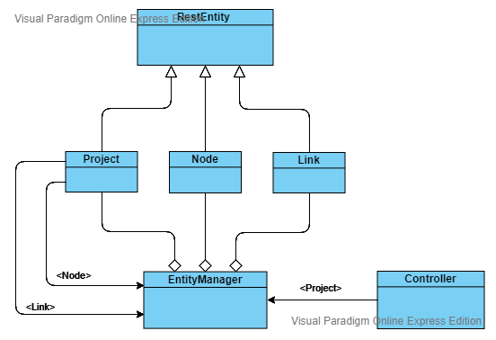

# Projet MDI de GNS3 de l'équipe *STOB-GNS*

## 1. Description 

### 1.1 Description du projet

  <p> Le projet consiste à créer une _API fluent pour GNS3_.

  <p> GNS3 est un logiciel libre permettant l'émulation ou la simulation de réseaux informatiques. Il est beaucoup utilisé dans le domaine des réseaux et télecom.</p> 

  <p> Une API REST GNS3 étant déjà existante, nous devons la prendre en main, la rendre fluent (c'est-à-dire qu'il deviendra possible d'avoir des compositions de méthodes), et y ajouter des méthodes de plus haut niveau pour faciliter l'expérience utilisateur.</p>

### 1.2 Du cahier des charges aux specs

  Après avoir compris les enjeux du projet, nous les avons mis en pages dans un cahier des charges ( voir [wiki](https://github.com/PapaTimot/ESIR2-Projet-MDI-GNS3/wiki/Cahier-des-charges)). 
  
   Cela nous a permis de bien mettre à plat nos idées, ce qui nous a permis de concevoir la structure du projet, mais aussi les specs (voir [wiki](https://github.com/PapaTimot/ESIR2-Projet-MDI-GNS3/wiki/Specs)).
  
   Le travail a été continue tout au long du projet. Pour surveiller notre évolution dans le temps nous avons, à chaque séance, réalisée un compte rendu de séance (voir [wiki](https://github.com/PapaTimot/ESIR2-Projet-MDI-GNS3/wiki/Compte-rendus-des-s%C3%A9ances) ). Cela nous a beaucoup aidé lors de la ré-orientation des tâches à accomplir.

### 1.3 Liens utiles à la compréhension du projet

  <p> Ici, vous trouverez les liens utiles à une compréhension plus approfondie du projet :</p>

 * [Slides du projet](https://docs.google.com/presentation/d/1Y9bsva_MXeW0O-p26TSM3rojNJ_YYPb8EkOBdd_jSNk/edit#slide=id.p)
 * [Wiki du projet](https://github.com/MiisterB/ESIR2-Projet-MDI-GNS3/wiki)
 * [Kanban du projet](https://github.com/MiisterB/ESIR2-Projet-MDI-GNS3/projects/1)


## 2. Installation

### 2.1 Installation globale 

<p> L'installation du projet est plutôt simple. </p>

  * Copier l'adresse du répertoire du projet 
 


  * Depuis votre console, cloner le repo
  
  ```
  git clone https://github.com/PapaTimot/ESIR2-Projet-MDI-GNS3.git
  ```
  * Vous avez accès au projet depuis votre machine 

### 2.2 Installation spécifique

#### 2.2.1 Utiliser les sources

Si vous voulez utiliser l'API depuis les sources ou modifier les sources : 

  * Installer JDK _verion 1.9_ si vous ne l'avez. 

  Vous trouverez le lien pour le télécharger au lien [suivant](https://jdk.java.net/java-se-ri/9)

  * L'une des librairies n'est pas synchronisée automatiquement, il faut le faire maniellement.

     * Dans le dossier lib, clique-droit sur commons-net-3.6.jar
     * Synchroniser la lib :  'Synchronize commons-net-3.6.jar'

#### 2.2.2 Utiliser le JAR

  <p> Si vous ne voulez qu'utilisez l'API, il vous suufit d'utiliser le jar. Pour l'utiliser il suffit de le compiler dans le projet dans lequel il sera utilisé. Vous avez maintenant accès à l'API GNS3 de l'équipe projet STOB.</p>

## 3. Structure de l'API

  La structure de l'API a été pensé pour être optimisée au maximum. Le diagramme de classe suivant représente notre architecture :


  Vous pourrez trouver au niveau de la page [wiki](https://github.com/PapaTimot/ESIR2-Projet-MDI-GNS3/wiki/Architecture-et-int%C3%A9gration-continue) suivante plus de détail sur l'archietecture et l'intégration continue. 


## 4. Utilisation 

### 4.1 Détails du GitFlow

  <p> Quand on veut développer une nouvelle fonctionnalité :</p> 
 * On commence par pull la branche *develop* 

```
git pull origin develop
```
...

  Pour avoir plus détail sur la façon de développer de nouvelles fonctionnalités : voir 
  [wiki](https://github.com/PapaTimot/ESIR2-Projet-MDI-GNS3/wiki/Détail-du-GitFlow)
  .

### 4.2 Liens pratiques JAVA

   Pour toutes questions de programmation vous trouverez des indications et début de piste de réponse au lien [wiki](https://github.com/PapaTimot/ESIR2-Projet-MDI-GNS3/wiki/Liens-pratiques-Java) suivant. Vous y trouverez :
  
  * Des tutos de prise en main de Spring
  * Des tutos de prise en main de REST template
  * La façon dont on manipule le JSON depuis JAVA 

## 5. Contributeurs

### 5.1 Compositions de l'équipe

<p> L'équipe projet STOB-GNS3 est coposée de :</p>

* Simon Moisan
* Timothée Schneider-Maunoury
* Oumar Ballo
* Besma Kaouane

<p> L'origine du nom du groupe provient de nos initials..</p>

### 5.2 Répartition des rôles

 Voir [wiki](https://github.com/PapaTimot/ESIR2-Projet-MDI-GNS3/wiki/R%C3%B4les)

### 5.3 Pratiques Agiles

  Pour la réalisation de ce projet, nous avons essayé au maximum d'appliquer les principes agiles qui nous ont été enseignés (voir [wiki](https://github.com/PapaTimot/ESIR2-Projet-MDI-GNS3/wiki/Pratiques-agiles) ).
