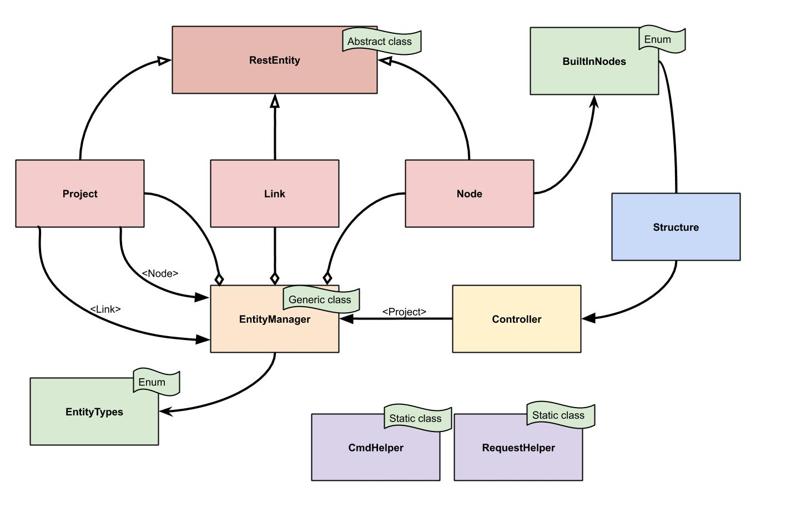

# Structure de l'API

  La structure de l'API a été pensé pour être modulable afin d'éviter au maximum la redondance de code et faciliter les évolutions. Le diagramme de classe suivant représente notre architecture :

  Vous pourrez trouver au niveau de la page [wiki](https://github.com/PapaTimot/ESIR2-Projet-MDI-GNS3/wiki/Architecture-et-int%C3%A9gration-continue) suivante plus de détail sur l'architecture et l'intégration continue. 
